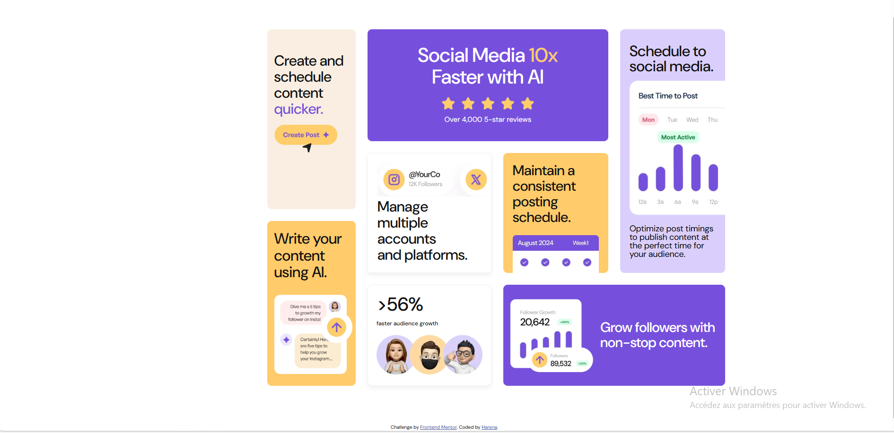

#Mentor Frontend -Bento Grid Solution

This is a solution to the [Bento Grid Challenge on Frontend Mentor](https://www.frontendmentor.io/challenges/bento-grid-RMydElrlOj). Frontend Mentor challenges help you improve your coding skills by building realistic projects. 

## Table of contents

-[Preview](#preview)
  -[The challenge](#the-challenge)
  -[Screenshot](#screenshot)
  -[Links](#links)
-[My process](#my-process)
  -[Built with](#built-with)
-[What I learned](#what-I-learned)
-[Continued development](#continued-development)
  -[Useful resources](#useful-resources)
-[Author](#author)
-[Acknowledgments](#acknowledgments)

## Overview

Creating a Bento Grid page. A challenge provided by Frontend Mentor that covers the use of CSS Grid.

### The challenge


The challenge is to create a responsive Bento Grid page so that it automatically adapts to all different devices.

### Screenshot


### Links
-Solution URL: [Add solution URL here](https://your-solution-url.com)
-Live Site URL: [Add live site URL here](https://your-live-site-url.com)

## My process

I created the page as follows:

### Built with

-HTML5 Semantics for SEO and accessibility
-CSS variables
-CSS Flexbox
-CSS Grid
-The mobile-first concept

### What I learned

In this project, I learned the following things:
-The correct use of HTML semantics:

```html
<section class="article__group" aria-label="article">
```
-CSS Grid manipulation

```css
.article__group{
    display: grid;
    grid-template-columns: repeat(4, 1fr);
    grid pattern areas: 
    "abbc"
    “a d e c”
    “f d e c”
    "fghh";
    gap: 2.5 rem;
    width: 100%;
    max-width: 1200px;
}
```
-The application of media queries

```css
@media screen and (max width: 750px) {
.article__groupe{
        affichage : flexible ;
        direction flexible : colonne ;
align-items: center;
        gap: 2rem;
        width: 85%;
    }

    .social , .accounts , .consistent ,
    .audience , .quicker , .followers , .ai , .schedule{
        width: 100%;
    }
}

@media screen and (max-width : 1024px){
    .article__group{
        grid-template-columns: repeat(2 , 1fr);
    }
}
```

### Continued development
In the next project, I will focus a lot on the correct use of CSS properties for responsive.

### Useful resources
-[MDN Web Docs](https://developer.mozilla.org/en-US/) -This is my official document for learning HTML CSS and JS concepts
-[W3 Schools](https://www.w3schools.com/) -This is my favorite place to quickly review CSS properties.

##Author

-Website -[Harena](https://github.com/Harena-debug)
-Frontend Mentor -[@Harena-debug](https://www.frontendmentor.io/profile/Harena-debug)

## Acknowledgments
I also thank Frontend Mentor for giving me this challenge which covers the skills of CSS Grid, thank you also to the AI for helping me in the areas which blocked me in this course.